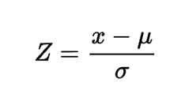

## Loading in the data sets. For this project, we have selected the Wisconsin Breast Cancer Dataset. It provides features of Fine Needle Aspirates of breast cancer samples from patients from the University of Wisconsin Medical Center and has been commonly used in Machine Learning.
```{r setup, include=FALSE}
knitr::opts_chunk$set(echo = TRUE)
library(tidyverse)
f<-"https://raw.githubusercontent.com/mrpickett26/Final_Group_Project/main/WBCDSdata.csv"
d<- read_csv(f, col_names=TRUE) ## load in the Wisconsin breast cancer dataset

#https://www.kaggle.com/code/shravank/predicting-breast-cancer-using-pca-lda-in-r/report

#Use^ as a reference
```

## Goals of the project

[1] provides background on the statistical method/topic/data visualization procedure that you have chosen to explore and [2] takes a user through one or more examples of the application of the approach with a real dataset. 
create and call at least 2 functions with documentation!!
custom r package
one or more datasets
WHY IS THIS USEFUL? WHAT KIND OF DATA IS IT USED WITH?


## Introduction

Principal component analysis is a dimensionality-reduction method, that is used with multi-dimensional data sets, by transforming the variables into smaller components, without eliminating much of the data. Even though some of the accuracy may be compromised, PCA is great for simplifying very complicated and large data sets and exploring overall patterns as well as preparing the dataset for data visualization.

The process of PCA can be broken down to 5 steps

### Step 1: Standardizing all variables

Whenever working with different data types (e.g., different measurements, units, scales, percentages...etc.) it is crucial to standardize the variables before conducting any further analysis, so any variances are measured on the same scale.

Statistically speaking this means z-scoring all the variables.

```{r z score image, echo=FALSE, out.width="##%"}


```

When working in R we can use the scale() function to standardize our variables.


```{r z score example, echo=TRUE}

#here we should show and example from our data set

d$Zvariable <- score(d$variable)

```

### Step 2: Creating a covariance Matrix

Next, we need to understand how each variables is different from the mean and see of there are any associations. To do this, we will need to create a covariance matrix, which is a symmetric matrix that includes all the variables (covariates) and the initial variables. 


Statistically it looks something like this. 

```{r matrix image, echo=FALSE, out.width="##%"}
knitr::include_graphics("images/Screenshot 2022-04-20 at 12.59.42 PM.png")

```

When working in R, we can use the cov() function to create the covariate matrix

```{r covariance, echo=TRUE}

cov(d)

```

### Step 3: Computing the eigenvectors and eigenvalues

Eigenvectors and eigenvalues are linear transformations of a nonzero vector that allow us to determine the *principal components* of the data.

Therefore, this new way of organizing the data will allow us to reduce complexity (dimensionality) without loosing much information.

Computationally, this looks like this

```{r eigen› image, echo=FALSE, out.width="##%"}
knitr::include_graphics("images/eigen.png")

```

To do this in R, we can use the eigen() function

```{r eigen, echo=TRUE}

e<-eigen(d)

e$values
e$vectors

```

### Step 4: Selecting the feature vector - Feture vector extraction

Once we calculate the eigenvectors and eigenvalues, we can organize the prinicipal factors in the order of significance and choose our best (most significant) matrix. 

```{r feture extract, echo=TRUE}


```

### Step 5: Recasting the data along the principal components axes

By using the selected feature vector we can finally reorient the data using the axes from the principal components.

```{r recast extract, echo=TRUE}


```

## PCA in less steps

When working in R, we can skip a lot of these steps by running the prcomp() function and setting the arguments center and scale to be true. Then the summary() will give us the best model(s).

```{r PCA extract, echo=TRUE}

d.pca<-prcomp(d[,c(x,y,z)], center=TRUE, scale. =TRUE)
```


# Visualizing PCA

Let's install ggbiplot to explore some ways in which we can visualize PCAs.

```{r PCA visual, echo=TRUE}

library(devtools)
install_github("vqv/ggbiplot")

d.groups<-c(rep("something", "x"), rep("other", "y"), rep("else", "z"))

ggbiplot(d.pca, label=rownames(d), ellipse=TRUE, circle=TRUE, groups=d.groups)


```


