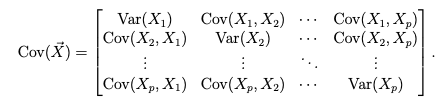
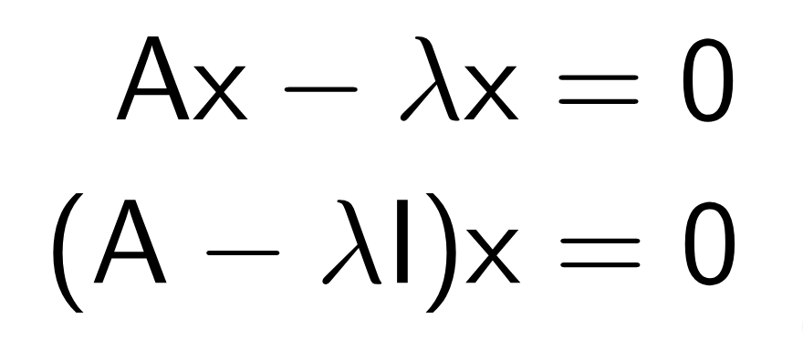

## Goals of the project (probably should delete after finalizaing)

[1] provides background on the statistical method/topic/data visualization procedure that you have chosen to explore  --> DONE
[2] takes a user through one or more examples of the application of the approach with a real dataset. --> DONE

create and call at least 2 functions with documentation!! --> DONE
custom r package --> NOT DONE
one or more datasets--> DONE

WHY IS THIS USEFUL? WHAT KIND OF DATA IS IT USED WITH? --> NOT DONE


## Introduction

Principal component analysis is a dimensionality-reduction method, that is used with multi-dimensional data sets, by transforming the variables into smaller components, without eliminating much of the data. Even though some of the accuracy may be compromised, PCA is great for simplifying very complicated and large data sets and exploring overall patterns as well as preparing the dataset for data visualization.

##You may be wondering why is PCA useful?
The most important use of PCA is to represent a multivariate data table as smaller set of variables (summary indices) in order to observe trends, jumps, clusters and outliers. PCA is a very flexible tool and allows analysis of datasets that may contain, for example, multicollinearity, missing values, categorical data, and imprecise measurements. The goal of PCA is to extract the important information from the data and to express this information as a set of summary indices called principal components. (https://www.sartorius.com/en/knowledge/science-snippets/what-is-principal-component-analysis-pca-and-how-it-is-used-507186)

When to use PCA: 
-PCA technique is particularly useful in processing data where multi-colinearity exists between the features/variables.
-PCA can be used when the dimensions of the input features are high (e.g. a lot of variables).
-PCA can be also used for denoising and data compression.
(https://towardsdatascience.com/pca-clearly-explained-how-when-why-to-use-it-and-feature-importance-a-guide-in-python-7c274582c37e)

Qualities of datasets that make it good for PCA: 
-PCA works with datasets with NUMERIC variables, it is very hard to do distance calculations and standardize/normalize mixed datasets or categorical variables. There are better methods for doing what PCA does for mixed/categorical datasets.
-PCA works best on data set having 3 or higher dimensions. Because, with higher dimensions, it becomes increasingly difficult for us to make interpretations from the resultant cloud of data.
(https://www.analyticsvidhya.com/blog/2016/03/pca-practical-guide-principal-component-analysis-python/)


Generally PCA in R 

The process of PCA can be broken down to 5 steps

## Step 1: Standardizing all variables

Whenever working with different data types (e.g., different measurements, units, scales, percentages...etc.) it is crucial to standardize the variables before conducting any further analysis, so any variances are measured on the same scale. The goal is to make the variables comparable. Generally variables are scaled to have i) standard deviation one and ii) mean zero.

Statistically speaking this means z-scoring all the variables.

When working in R we can use the scale() function to standardize our variables, but for a refresher on normalization of data, we have included a documented scale function below. 
```{r setup, echo=TRUE, warning=FALSE, message=FALSE}
knitr::opts_chunk$set(echo = TRUE)

library(tidyverse)
library(dplyr)
library(caret)
library(corrplot)
library(readr)

f<-"https://raw.githubusercontent.com/mrpickett26/Final_Group_Project/main/WBCDSdata.csv"
wdbc<- read_csv(f, col_names=TRUE) ## load in the Wisconsin breast cancer dataset
wbg <- read.csv2("https://userpage.fu-berlin.de/soga/300/30100_data_sets/DWD.csv", stringsAsFactors = FALSE)

```

```{r scale, echo=TRUE, warning=FALSE, message=FALSE}
knitr::opts_chunk$set(echo = TRUE)

scale_func<-function(x)
   {(x-mean(x))/sd(x)
}

#Now we can try it out using both the built in function and our function

#Using our scale function
wbg_funct_scale<-lapply(wbg[,sapply(wbg, is.numeric)], scale_func)

#Using the built in R function
wbg_scale_built_in<-scale(wbg, center = TRUE, scale = TRUE)

```

In the prcomp() functions we will take care of this by scale=TRUE and the princomp() function will take care of this when cor=TRUE. The princomp() and prcomp() represent two different methods of doing PCA. The two methods are 
   1. Spectral decomposition which explores the covariances / correlations between variables (prcomp()) &
   2. Singular value decomposition which looks at the covariances / correlations between individuals or individual samples as a whole (princomp())
   
In this overview we will cover two data sets for PCA analysis. For one we will use 1. spectral decomposition and for the other we will use 2. single value decomposition. 

1) The dataset we will use for the singular value decomposition is data from a weather station in Berlin, Germany. Each component corresponds to a particular variable related to the single weather station. This analysis is adapted from (https://www.geo.fu-berlin.de/en/v/soga/Geodata-analysis/Principal-Component-Analysis/PCA-an-example/Data-preparation/index.html). 

2) The dataset we will use for Single Value Decomposition is the Wisconsin Breast Cancer dataset. It provides features of Fine Needle Aspirates of breast cancer samples from patients from the University of Wisconsin Medical Center and has been commonly used in Machine Learning. The code used for this PCA analysis was adapted from (https://www.kaggle.com/code/shravank/predicting-breast-cancer-using-pca-lda-in-r/report).

We can go ahead and load in the needed packages and datasets for this analysis. One package you might not be familiar with is the caret package, which has the findcorrelation() function. This function allows us to remove highly correlated predictors. 


Now we should make the data into a tidier format where we can use it more easily, we also want to clean it up-- in the weather dataset we can exclude some features before we even begin analysis to make it a little more straightforward. In this case we are looking at how the variables interact with each other regardless of ID number, so we can drop any ID variables.

```{r tidy BG, echo=TRUE}
wbg<- wbg%>%select(LAT, LON, ALTITUDE, RECORD.LENGTH, MEAN.ANNUAL.AIR.TEMP, MEAN.MONTHLY.MAX.TEMP, MEAN.MONTHLY.MIN.TEMP, MEAN.ANNUAL.RAINFALL, MEAN.ANNUAL.SUNSHINE, MEAN.ANNUAL.WIND.SPEED,MEAN.RANGE.AIR.TEMP, MEAN.CLOUD.COVER, MAX.RAINFALL) 

str(wbg)

wbg<-na.omit(wbg)
```

The WBC data set has tumors classified as benign and malignant, it is useful to go ahead and break down the dataset into those two subgroups [Benign and Malignant] and subset them by response variable. 

```{r tidy BC, echo=TRUE}
wdbc.data <- as.matrix(wdbc[,c(3:32)])
row.names(wdbc.data) <- wdbc$id
diagnosis <- as.numeric(wdbc$diagnosis == "Malignant") #Creates a new diagnosis vector
outcome<- wdbc$diagnosis

round(colMeans(wdbc.data),2) #It is also helpful to know the mean of the columns. This finds the means of each variable in the matrix. 

# Also helpful to know the standard deviations of each variable in building the PCA model
SD_var <- function(x){
    round(sd(x), 2)
}
apply(wdbc.data, 2, SD_var)

corMatrix <- wdbc[,c(3:32)]

#This function creates a correlation matrix. A correlation matrix is a table that demonstrates which variables have a linear relationship between them. 
M <- round(cor(corMatrix), 2)

#Allows for visualization of the correlation matrix in a correlation plot. 
corrplot(M, diag = FALSE, method="color", order="FPC", tl.srt = 90)

#This plot shows us that there are many variables that are correlated to one another 
```

## Step 2: Creating a covariance Matrix

Next, we need to understand how each variable is different from the mean and see if there are any associations. To do this, we will need to create a covariance matrix, which is a p x p symmetric matrix (where p is the number of dimensions) that includes all the variables (covariates) and the initial variables. 

Statistically it looks something like this. 

```{r matrix image, echo=FALSE, out.width="##%"}


```

We can create this covariance matrix by following these steps:

1) Spectral decomposition

```{r wbg prcomp, echo=TRUE}

wbg.pcov <- prcomp(wbg, cor=FALSE, scores=TRUE) #error with infinite or missing values
summary(wbg.pcov) #Build the covariance matrix

cex.before <- par("cex")
par(cex = 0.7)
biplot(wbg.pcov) #Create a biplot of the covariance

str(wbg)
```

2) Singular value decomposition

```{r wdbc princomp, echo=TRUE}
wdbc.pcov <- princomp(wdbc.data, scores = TRUE)
summary(wdbc.pcov) #Build the covariance matrix

cex.before <- par("cex")
par(cex = 0.7)
biplot(wdbc.pcov) #Create a biplot of the covariance

```

When working in R, we can also use the cov() function to create the covariate matrix

```{r covariance, echo=TRUE}

cov(wbg)

cov(wdbc.data)

```

## Step 3: Computing the eigenvectors and eigenvalues

Eigenvectors and eigenvalues are linear transformations of a nonzero vector that allow us to determine the *principal components* of the data.

Therefore, this new way of organizing the data will allow us to reduce complexity (dimensionality) without losing much information.

Computationally, this looks like this:

```{r eigen› image, echo=FALSE, out.width="##%"}


```

After creating the biplots in the previous step, we can see that area_worst and area_mean have much larger covariances than the other variables included. This is due to a scale issue and therefore indicates to us that we need to scale those variables for future PCA analysis. Let's calculate the eigenvectors and eigenvalues in the following steps.

```{r eigen by hand, echo=TRUE}
par(cex = cex.before)
par(mfrow = c(1, 2)) #Set up a grid for PCA analysis
pr.cvar <- wbg.pcov$sdev ^ 2 #Calculate variability of each variable
pve_cov_wbg <- pr.cvar/sum(pr.cvar) #Calculate the variance as explained by each principle component

# We now need to calculate the eigen values and percent variance of each variable or "component" 
round(pr.cvar, 2) #Eigen Values
round(pve_cov_wbg, 2) # Percent Variance

#use the prcomp() function to calculate the eigenvectors
wbg.pr <- prcomp(wbg, scale = TRUE, center = TRUE)
summary(wbg.pr)

######wdbc

par(cex = cex.before)
par(mfrow = c(1, 2)) #Set up a grid for PCA analysis
pr.cvar <- wdbc.pcov$sdev ^ 2 #Calculate variability of each variable
pve_cov <- pr.cvar/sum(pr.cvar) #Calculate the variance as explained by each principle component

# We now need to calculate the eigen values and percent variance of each variable or "component" 
round(pr.cvar, 2) #Eigen Values
round(pve_cov, 2) # Percent Variance

#use the prcomp() function to calculate the eigenvectors
wdbc.pr <- prcomp(wdbc.data, scale = TRUE, center = TRUE)
summary(wdbc.pr)

```


## Step 4: Selecting the feature vector - Feture vector extraction

We can now use these metrics to calculate the cumulative percentages. Cumulative percentage is another way of expressing frequency distribution. It calculates the percentage of the cumulative frequency within each interval, much as relative frequency distribution calculates the percentage of frequency. The main advantage of cumulative percentage over cumulative frequency as a measure of frequency distribution is that it provides an easier way to compare different sets of data.Cumulative percentage is calculated by dividing the cumulative frequency by the total number of observations (n), then multiplying it by 100 (the last value will always be equal to 100%).

It is useful in PCA to create a scree plot of covariance and cumulative proportion of variance explained. In multivariate statistics, a scree plot is a line plot of the eigenvalues of factors or principal components in an analysis. The scree plot is used to determine the number of factors to retain in an exploratory factor analysis (FA) or principal components to keep in a principal component analysis (PCA). 

We can begin this step by looking at the German dataset. 
```{r feature extract German dataset, echo=TRUE}

round(cumsum(pve_cov_wbg), 2) #Cumulative percentage

# Plot variance explained for each principal component
plot(pve_cov_wbg, xlab = "Principal Component", 
     ylab = "Proportion of Variance Explained", 
     ylim = c(0, 1), type = "b")


# Plot cumulative proportion of variance explained
plot(cumsum(pve_cov_wbg), xlab = "Principal Component", 
     ylab = "Cumulative Proportion of Variance Explained", 
     ylim = c(0, 1), type = "b")
```
Now the Wisconsin dataset. 
```{r feature extract Wisconsin dataset, echo=TRUE}
round(cumsum(pve_cov), 2) #Cumulative percentage

# Plot variance explained for each principal component
plot(pve_cov, xlab = "Principal Component", 
     ylab = "Proportion of Variance Explained", 
     ylim = c(0, 1), type = "b")


# Plot cumulative proportion of variance explained
plot(cumsum(pve_cov), xlab = "Principal Component", 
     ylab = "Cumulative Proportion of Variance Explained", 
     ylim = c(0, 1), type = "b")

```

In the scree plots the first two or three PCs have capture most of the information. A scree plot shows how much variation each PC captures from the data, where the y axis represents the  eigenvalues, which are the amount of variation. A scree plot is used to select which principal components to keep. An ideal curve should start as steep, then bends at an “elbow”  and finally flatten out. Our covariance matrix does not shows this trend for the Germany weather data, but does not for the wisconsin breast cancer dataset. Therefore we will move to a correlation matrix to see if PC selection outcomes can be improved for this wisconsin breast cancer dataset.

## Step 5: Recasting the data along the principal components axes

By using the selected feature vector we can finally reorient the WBC data using the axes from the principal components.

```{r recast extract, echo=TRUE}

# Set up 1 x 2 plotting grid
par(mfrow = c(1, 2))

# Calculate variability of each component
pr.var <- wdbc.pr$sdev ^ 2

# Assign names to the columns to be consistent with princomp.
# This is done for reporting purposes.
names(pr.var) <- names(pr.cvar)

# Variance explained by each principal component: pve
pve <- pr.var/sum(pr.var)

# Assign names to the columns as it is not done by default.
# This is done to be consistent with princomp.
names(pve) <- names(pve_cov)

round(pr.var, 2) #Eigen values 
round(pve, 2) #Percent variance explained
round(cumsum(pve), 2) # Cummulative percent explained

plot(pve, xlab = "Principal Component", 
     ylab = "Proportion of Variance Explained", 
     ylim = c(0, 1), type = "b")

# Plot cumulative proportion of variance explained
plot(cumsum(pve), xlab = "Principal Component", 
     ylab = "Cumulative Proportion of Variance Explained", 
     ylim = c(0, 1), type = "b")

```
A majority of the variation is explained by the first six PC’s and the eigen values associated with the first 6 PC’s are greater than 1. This is the selection criteria we will use for the rest of the WBC data PCA.

Another way to determine the number of factors to use in PCA is through the preprocess() function in the caret package. This by default keeps the components that explain 95% of the variance but can be changed using the thresh or pcaComp parameter. 
```{r caret package extract, echo=TRUE}
preProc <- preProcess(wbg,method="pca",thresh = 0.95) #Can substitutr in thresh with PCAcomp to change number of components you want to account for 
predictPC <- predict(preProc, wbg)
plot(predictPC[,3],predictPC[,4],col=blues9)

```
This result can also be represented by the graph above where most of the points are clustered on the y-axis around 0. This indicated to us that the variables can probably be combined and retain most of the information found from both variables, separately. By changing out the variables in the caret package (what is included in the brackets), we can better understand what is happening/the relationship between the variables which assists in preprocessing for dimensionality reduction.

Sub in different variables:
```{r caret package extract num2, echo=TRUE}
preProc2 <- preProcess(wbg,method="pca",thresh = 0.95) #Can substitutr in thresh with PCAcomp to change number of components you want to account for 
predictPC2 <- predict(preProc2, wbg)
plot(predictPC2[,4],predictPC2[,7],col=blues9)

```

## PCA in less steps

When working in R, we can skip a lot of these steps by running the prcomp() function and setting the arguments center and scale to be true. Then the summary() will give us the best model(s).

```{r PCA extract, echo=TRUE}
wbg.pca<-prcomp(wbg, center=TRUE, scale =TRUE)

wdbc.pca<-princomp(wdbc.data, center=TRUE, scale =TRUE)

wbg.pca
wdbc.pca
```


## Visualizing PCA

Let's install ggbiplot to explore some ways in which we can visualize PCAs.

```{r PCA visual, echo=TRUE, message=FALSE, echo=FALSE}

library(devtools)
library(ggfortify)

install_github("vqv/ggbiplot", force = TRUE)

library(ggbiplot)

ggbiplot(wbg.pca)

ggbiplot(wdbc.pca)

autoplot(wbg.pca)
autoplot(wdbc.pca)

```
The FactoMineR package can do PCA for you, and the factoextra package is useful in extracting components of the PCA analysis done by the FactoMineR package.  
```{r PCA builtin, echo=TRUE, message=FALSE, echo=FALSE}

library(FactoMineR)
library(factoextra)
wdbc.facoPCA<-PCA(wdbc.data, scale.unit = TRUE, ncp = 5, graph = TRUE)
get_eigenvalue(wdbc.facoPCA) #Extract the eigenvalues/variances of principal components
fviz_eig(wdbc.facoPCA) #Visualize the eigenvalues
get_pca_ind(wdbc.facoPCA) #get_pca_var(wdbc.facoPCA): Extract the results for individuals and variables, respectively.
fviz_pca_ind(wdbc.facoPCA) #fviz_pca_var(wdbc.facoPCA): Visualize the results individuals and variables, respectively.
fviz_pca_biplot(wdbc.facoPCA) #Make a biplot of individuals and variables.
```
 


